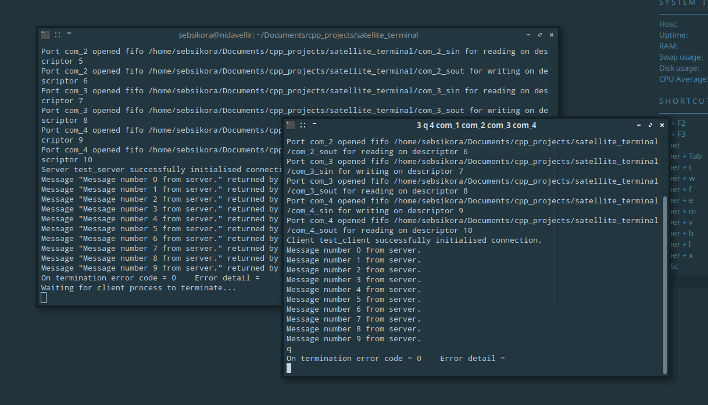

# satellite_terminal
<br />


<br />

© 2021 Dr Sebastien Sikora.

[seb.nf.sikora@protonmail.com](mailto:seb.nf.sikora@protonmail.com)
<br />
<br />

A simple C++ library for POSIX compatible operating systems that enables your project to easily launch and communicate bidirectionally with client processes connected to separate terminal emulator instances.
<br />

Updated 30/11/2021.
<br />
<br />

## What is it?

satellite_terminal automates the process of launching a client process connected to it's own terminal emulator instance from within a parent process, linked with an arbitrary number of [named pipes](https://en.wikipedia.org/wiki/Named_pipe) to allow bidirectional interprocess communication.

satellite_terminal leverages the functionality defined in the [unistd.h](https://en.wikipedia.org/wiki/Unistd.h), [sys/stat.h](https://en.wikibooks.org/wiki/C_Programming/POSIX_Reference/sys/stat.h) & [fcntl.h](https://pubs.opengroup.org/onlinepubs/007904875/basedefs/fcntl.h.html) headers, and as-such will work only with [POSIX compatible](https://en.wikipedia.org/wiki/POSIX) operating systems and [environments](https://www.cygwin.com/). satellite_terminal has to-date been compiled and tested on GNU/Linux.

satellite_terminal is easy to incorporate and use within your own projects, as the basic examples below will demonstrate.
<br />
<br />

## How to use it?

Using satellite_terminal in a C++ project is very easy. Let's demonstrate this via a simple example.
<br />
<br />

### Parent process

The parent process spawns the child process by instantiating a SatTerm_Server. The server constructor is passed an identifier string and the path to the child process binary as arguments.

By default two named pipes will be created to form a tx-rx pair, but an arbitrary of tx and rx named pipes can be created if desired.
<br />

```cpp
// parent.cpp
#include "satellite_terminal.h"
...

// Server constructor prototype in satellite_terminal.h:
//
// SatTerm_Server(std::string const& identifier, std::string const& path_to_client_binary, bool display_messages = true,
//                std::string const& terminal_emulator_paths = "./terminal_emulator_paths.txt", size_t stop_fifo_index = 0,
//                size_t sc_fifo_count = 1, size_t cs_fifo_count = 1, char end_char = 3, std::string const& stop_message = "q");
//
SatTerm_Server sts("test_server", "./child_binary");

// Path to child binary above can incorporate desired command-line arguments
// eg: "./client_demo --full-screen=true"

if (sts.IsConnected()) {
	// We are good to go!
	...
}
...
```
<br />

The server constructor will create the named pipe temporary files in the working directory and then spawn a terminal emulator (from the list in `terminal_emulator_paths.txt`) via-which it will directly execute the child binary via the '-e' option. The paths to the named pipes and all other required parameters are automatically passed to the child process as command-line options.

The server constructor will return once the communication channel is established with the child process, an error occurs or a timeout is reached. When it returns, if the server's `IsConnected()` member function returns `true`, the child process started correctly and the bi-directional communication channel was established without error.
<br />
<br />

### Child process

Client parameters are passed to the child process via it's command-line arguments, therefore argc and argv must be passed to the SatTerm_Client constructor.

The parameters are appended directly onto the child binary path string passed to the server constructor following an automatically applied delimiter ("client_args"), so you can use any command-line arguments required by the child process as normal and the client constructor will automatically parse the remaining arguments.
<br />

```cpp
// child.cpp
#include "satellite_terminal.h"

int main(int argc, char *argv[]) {
	
	// -- Your argument parser goes here ---
	//      -- Don't modify argc/v! --
	
	SatTerm_Client stc("test_client", argc, argv);
	
	if (stc.IsConnected()) {
		// We are good to go!
		...
	}
...
```
<br />

The client constructor will return once the communication channel is established with the parent process, an error occurs or a timeout is reached. When it returns, if the client's `IsConnected()` member function returns `true`, the bi-directional communication channel was established without error.
<br />
<br />

### Sending and receiving

Blah...
<br />

```cpp
// SendMessage() function prototype in satellite_terminal.h:
//
// std::string SendMessage(std::string const& message, size_t tx_fifo_index = 0, unsigned long timeout_seconds = 10);

std::string message_unsent = stc.SendMessage("Outbound message");


// GetMessage() function prototype in satellite_terminal.h:
//
// std::string GetMessage(size_t rx_fifo_index = 0, bool capture_end_char = false, unsigned long timeout_seconds = 0);

std::string inbound_message = stc.GetMessage();

```
<br />

Blah [blah]() `blah.cpp`.

Blah.
<br />
<br />

## Complete basic example

Blah...
<br />

```cpp
// server_demo.cpp

#include <unistd.h>                 // sleep(), usleep().
#include <ctime>                    // time().
#include <iostream>                 // std::cout, std::cerr, std::endl.
#include <string>                   // std::string.

#include "satellite_terminal.h"

int main (void) {
	
	SatTerm_Server sts("test_server", "./client_demo");
	
	if (sts.IsConnected()) {
		size_t message_count = 10;
		for (size_t i = 0; i < message_count; i ++) {
			std::string outbound_message = "Message number " + std::to_string(i) + " from server.";
			sts.SendMessage(outbound_message);
		}
		
		unsigned long timeout_seconds = 5;
		unsigned long start_time = time(0);
		
		while ((sts.GetErrorCode().err_no == 0) && ((time(0) - start_time) < timeout_seconds)) {
			std::string inbound_message = sts.GetMessage();
			if (inbound_message != "") {
				std::cout << "Message \"" << inbound_message << "\" returned by client." << std::endl;
			}
			usleep(1000);
		}
		
		std::cerr << "On termination error code = " << sts.GetErrorCode().err_no << "    Error detail = " << sts.GetErrorCode().detail << std::endl;
		
	} else {
		
		std::cerr << "On termination error code = " << sts.GetErrorCode().err_no << "    Error detail = " << sts.GetErrorCode().detail << std::endl;
		
	}
	return 0;
}
```
<br />

Blah...
<br />

```cpp
// client_demo.cpp

#include <unistd.h>                 // sleep(), usleep().
#include <ctime>                    // time().
#include <iostream>                 // std::cout, std::cerr, std::endl.
#include <string>                   // std::string.

#include "satellite_terminal.h"

int main(int argc, char *argv[]) {
	
	SatTerm_Client stc("test_client", argc, argv);

	if (stc.IsConnected()) {
		
		while (stc.GetErrorCode().err_no == 0) {
			
			std::string inbound_message = stc.GetMessage();
			
			if (inbound_message != "") {
				std::cout << inbound_message << std::endl;
				if (inbound_message != stc.GetStopMessage()) {
					stc.SendMessage(inbound_message);
				} else {
					break;
				}
				
			}
			usleep(1000);
		}
		std::cerr << "On termination error code = " << stc.GetErrorCode().err_no << "    Error detail = " << stc.GetErrorCode().detail << std::endl;
		sleep(5);        // Delay to read the message before terminal emulator window closes.
	} else {
		std::cerr << "On termination error code = " << stc.GetErrorCode().err_no << "    Error detail = " << stc.GetErrorCode().detail << std::endl;
		sleep(5);        // Delay to read the message before terminal emulator window closes.
	}
	return 0;
}
```
<br />

Compile `server_demo.cpp` and `client_demo.cpp`, then execute `server_demo` from within the project directory:
<br />

```
user@home:~/Documents/cpp_projects/satellite_terminal$ g++  -Wall -g -O3 -I src/ src/satterm_agent.cpp src/satterm_client.cpp src/satterm_server.cpp src/satterm_port.cpp demos/server_demo.cpp -o server_demo
user@home:~/Documents/cpp_projects/satellite_terminal$ g++  -Wall -g -O3 -I src/ src/satterm_agent.cpp src/satterm_client.cpp src/satterm_server.cpp src/satterm_port.cpp demos/client_demo.cpp -o client_demo
user@home:~/Documents/cpp_projects/satellite_terminal$ ./server_demo 
Server working path is /home/user/Documents/cpp_projects/satellite_terminal/
Client process started.
Client process attempting to execute via terminal emulator '-e':
./client_demo client_args /home/user/Documents/cpp_projects/satellite_terminal/ 3 q 1 1 server_rx server_tx
Trying /usr/bin/x-terminal-emulator
In Port server_rx opened fifo /home/user/Documents/cpp_projects/satellite_terminal/server_rx for reading on descriptor 3
Out Port server_tx opened fifo /home/user/Documents/cpp_projects/satellite_terminal/server_tx for writing on descriptor 4
Server test_server successfully initialised connection.
Message "Message number 0 from server." returned by client.
Message "Message number 1 from server." returned by client.
Message "Message number 2 from server." returned by client.
Message "Message number 3 from server." returned by client.
Message "Message number 4 from server." returned by client.
Message "Message number 5 from server." returned by client.
Message "Message number 6 from server." returned by client.
Message "Message number 7 from server." returned by client.
Message "Message number 8 from server." returned by client.
Message "Message number 9 from server." returned by client.
On termination error code = 0    Error detail = 
Waiting for client process to terminate...
EOF error on GetMessage() for In Port server_rx suggests counterpart terminated.
user@home:~/Documents/cpp_projects/satellite_terminal$
```
<br />

Output in child terminal emulator instance:
<br />

```
Client working path is /home/user/Documents/cpp_projects/satellite_terminal/
Out Port server_rx opened fifo /home/user/Documents/cpp_projects/satellite_terminal/server_rx for writing on descriptor 3
In Port server_tx opened fifo /home/user/Documents/cpp_projects/satellite_terminal/server_tx for reading on descriptor 4
Client test_client successfully initialised connection.
Message number 0 from server.
Message number 1 from server.
Message number 2 from server.
Message number 3 from server.
Message number 4 from server.
Message number 5 from server.
Message number 6 from server.
Message number 7 from server.
Message number 8 from server.
Message number 9 from server.
q
On termination error code = 0    Error detail = 
```
<br />

Blah...
<br />
<br />

## License:
<br />


<br />
<br />

satellite_terminal is distributed under the terms of the MIT license.
Learn about the MIT license [here](https://choosealicense.com/licenses/mit/)

